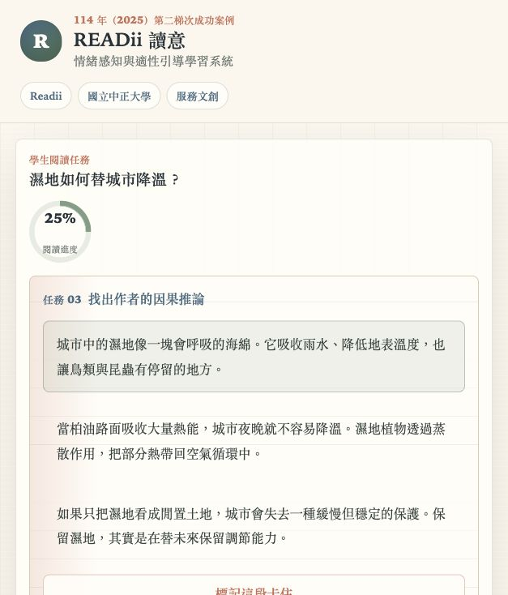
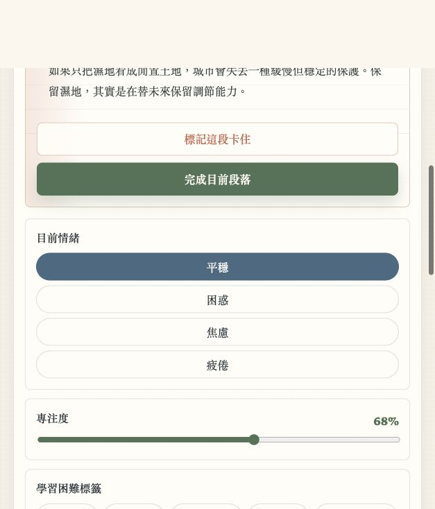

# READii 讀意｜情緒感知與適性引導學習系統

## 快速看懂

- 線上 Demo：https://atlasforcn.github.io/startup-readii-emotion-learning/
- 這個原型在做什麼：把 READii 做成閱讀時的情緒感知與適性引導學習平台。
- 特色定位：特色是把學生情緒/專注狀態和教師班級總覽連在一起，形成可追蹤的學習支持。
- 操作流程：選擇閱讀任務與學生狀態 → 切換情緒/專注並取得引導卡 → 教師查看班級困難標籤與進度報告

展開完整功能流程截圖

這是一個可直接用瀏覽器開啟的靜態 demo repo，將 READii 讀意的公開得獎概念延伸成「閱讀／學習時情緒感知與適性引導平台」原型。頁面不是介紹頁，而是可操作的學習工作台：學生可以切換情緒與專注狀態、標記閱讀困難、取得即時引導；教師可以查看班級總覽、學習困難標籤、回饋建議與進度報告。

## 比賽與案例資訊

- 比賽來源：大專校院創新創業實戰模擬學習平臺
- 年度：114 年（2025）
- 屆次／階段：第二梯次成功案例
- 團隊／公司：Readii
- 學校：國立中正大學
- 類別：服務文創
- 作品名稱：READii 讀意｜情緒感知與適性引導學習系統
- 官方來源：https://ssp.moe.gov.tw/cases/1685

## Demo 功能

- 學生閱讀任務：以一篇短文作為學習材料，段落完成後會更新進度。
- 情緒與專注狀態切換：可切換平穩、困惑、焦慮、疲倦，並調整專注度。
- 即時引導卡：依情緒、專注度、困難標籤與進度產生適性引導。
- 學習困難標籤：可標記詞彙不熟、推論斷點、注意力下滑、時間估計失準等狀態。
- 教師班級總覽：顯示學生狀態、班級分布、需關注名單與回饋建議。
- 進度報告：即時整理目前完成度、狀態與下一步建議。

## 使用方式

直接開啟 `index.html` 即可使用，不需要安裝套件、建置流程或外部服務。此 repo 使用純 HTML、CSS、JavaScript，適合部署到 GitHub Pages。

## 檔案說明

- `index.html`：靜態頁面與可見內容。
- `styles.css`：紙本閱讀氛圍、響應式版面與互動狀態。
- `app.js`：狀態切換、引導建議、班級總覽與報告更新。
- `SOURCE.md`：來源整理、改作範圍與免責聲明。

## 免責聲明

這是依公開得獎資訊與概念自行製作的興趣原型，不是原團隊官方 demo 或產品。
